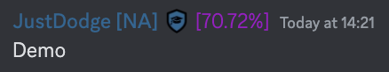
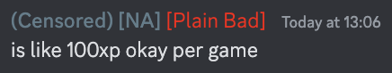

## WoWS Community Monitor

A BetterDiscord plugin that displays statistics next to usernames in World of Warships Community.

### Installation

Copy `dist/WoWSCommunityMonitor.plugin.js` to your plugins folder, and enable it from settings.

### Configuration

The configuration file is created in the plugins folder after first load.

The plugin can display Wargaming labels seen [here](https://youtu.be/Ye1Cr8qkar0?t=731) by changing `DISPLAY` from `WINRATE` to `LABEL`:

The rate limiter and cache can also be adjusted. While the endpoints used by the plugin have no posted ratelimit, it is recommended to stay below 15 reqs/s.

