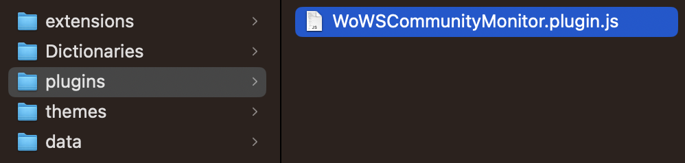

## WoWS Community Monitor

A BetterDiscord plugin that displays statistics next to usernames in World of Warships Community.

### Installation

1. Install [BetterDiscord](https://betterdiscord.app/)
2. Download the compiled plugin by clicking "download raw file" on [dist/WoWSCommunityMonitor.plugin.js](https://github.com/padtrack/wows-community-monitor/blob/main/dist/WoWSCommunityMonitor.plugin.js)
3. Move the compiled plugin to your plugins folder, which can be found in `Settings > BetterDiscord > Plugins > Open Plugins Folder`.

You should end up with a file structure similar to the image below.

### Configuration

The configuration file is created in the plugins folder after first load.

The plugin can display Wargaming labels seen [here](https://youtu.be/Ye1Cr8qkar0?t=731) by changing `DISPLAY` from `WINRATE` to `LABEL`:

The rate limiter and cache can also be adjusted. While the endpoints used by the plugin have no posted ratelimit, it is recommended to stay below 15 reqs/s.

